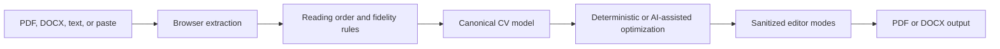

# Resume Builder: Engineering Overview

## Why the problem is interesting

CV files are semi-structured documents, not clean records. Reading order, headings, columns, line breaks, and styled DOCX content can be lost before any AI model sees the text. Resume Builder therefore separates ingestion, fidelity normalization, canonicalization, optimization, editing, and export instead of treating the whole workflow as a single prompt.

## Guided code tour

1. `src/js/upload/textExtractor.js` — PDF/DOCX loading, reading order, and text extraction.
2. `src/js/cv/fidelity.js` and `fidelitySpacing.js` — minimal normalization and layout-preservation rules.
3. `src/js/ai/canonicalizer.js` — canonical model construction with heuristic fallback.
4. `src/js/ai/promptBuilder.js` and `optimizer.js` — ATS/job-aware optimization boundary.
5. `src/js/views/editorModes.js` — styled/plain editor switching and sanitization.
6. `src/js/output/` — download and document-generation paths.
7. `scripts/smoke-test.js` — boot-critical HTTP contract exercised by CI.

## Engineering qualities

- **Graceful degradation:** demo and heuristic paths keep the application inspectable without paid credentials.
- **Document fidelity as a specification:** versioned rules make formatting behavior reviewable.
- **Browser safety boundary:** styled HTML is sanitized before it becomes editor content.
- **Agent continuity:** task protocols and handoff documents reduce dependence on hidden conversational context.
- **Cross-platform operations:** PowerShell and shell entrypoints cover setup, run, validation, and rollback.

## Current boundaries

- Provider-backed AI, Supabase, and Firebase paths are configuration-dependent and are not claimed as live services.
- Browser-side provider secrets are not a production design; a server-side proxy is required.
- The current suite is primarily configuration and HTTP smoke coverage, not comprehensive unit or end-to-end coverage.
- Document fidelity must be validated against a diverse real-world corpus before production use.
